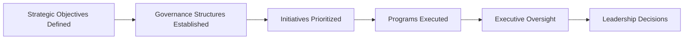
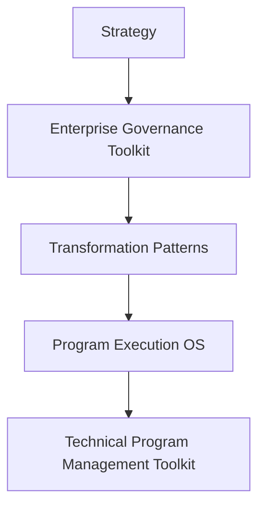

# Enterprise Governance Toolkit

> **Author:** Somer Walker  
> Creator of the Transformation Operating Framework, a model for aligning strategy, governance, and program execution in complex organizations.

This repository provides guidance for establishing governance structures that support leadership alignment, decision-making, and oversight across complex initiatives within an organization.

Enterprise governance operates at the organizational level and defines how leadership prioritizes initiatives, allocates resources, and oversees strategic programs.

The practices documented here help organizations maintain clarity around decision authority, escalation paths, and executive oversight across multiple initiatives.

---

## Part of the Transformation Operating Framework

This repository is a supporting component of the **Transformation Operating Framework**, a layered model for aligning strategy, governance, transformation initiatives, and execution across complex organizations.

The master framework repository provides the conceptual architecture connecting the various supporting modules.

Transformation Operating Framework  
https://github.com/somerwalker/transformation-operating-framework

---

## Why Enterprise Governance Matters

Organizations undertaking complex transformations often struggle with unclear decision authority, inconsistent leadership oversight, and fragmented alignment across initiatives.

Enterprise governance provides the leadership structures required to maintain strategic alignment across multiple programs and initiatives.

Effective governance helps organizations:

- align leadership around strategic priorities
- establish clear decision authority
- maintain visibility across major initiatives
- escalate risks and issues appropriately
- coordinate oversight across multiple programs
- ensure initiatives remain aligned with strategic objectives

Without structured governance, large transformation efforts can lose alignment between leadership intent and program execution.

---

## Enterprise Governance vs Program Governance

Governance operates at multiple levels within complex organizations.

Enterprise governance focuses on **organizational leadership oversight and strategic decision-making across initiatives**.

Program governance focuses on **execution coordination and delivery oversight within an individual initiative**.

If you are managing governance within a specific program, refer to the **Program Execution OS**, which provides guidance for program-level governance, delivery coordination, and operational reporting.

Program Execution OS  
https://github.com/somerwalker/program-execution-os

---

## Repository Model

This repository organizes governance structures around the core responsibilities required to maintain leadership alignment and oversight across complex initiatives.

The governance toolkit focuses on five core areas:

- Governance Structure  
- Decision Authority  
- Escalation Management  
- Portfolio Visibility  
- Leadership Cadence  

Example governance oversight flow:

This model helps organizations maintain clarity around leadership oversight and ensures major initiatives remain aligned with strategic objectives.

---

## Repository Contents

### 📘 Documentation

| File | Description |
|-----|-------------|
| docs/governance-principles.md | Core principles for effective enterprise governance |
| docs/governance-structure.md | Guidance for defining governance roles and structures |
| docs/decision-framework.md | Models for clarifying decision authority |
| docs/escalation-model.md | Framework for managing escalations across initiatives |
| docs/governance-cadence.md | Recommended leadership review cadence |

---

### 🧰 Templates

| File | Description |
|-----|-------------|
| templates/decision-log-template.md | Template for tracking governance decisions |
| templates/steering-committee-agenda-template.md | Template for governance meeting agendas |
| templates/governance-dashboard-template.md | Template for leadership oversight dashboards |

---

### 📊 Examples

| File | Description |
|-----|-------------|
| examples/example-governance-model.md | Example enterprise governance structure |
| examples/example-steering-committee.md | Example steering committee model |

---

## How This Repository Helps Organizations

Organizations managing multiple strategic initiatives often struggle to maintain consistent governance and leadership oversight.

This toolkit helps organizations:

- define clear governance structures
- clarify decision authority across initiatives
- improve leadership alignment
- maintain visibility into transformation programs
- manage escalations effectively

By establishing structured governance practices, organizations can maintain alignment between strategy, leadership decisions, and program execution.

---

## Relationship to the Transformation Operating Framework

This repository provides the governance layer of the **Transformation Operating Framework**.

While the framework defines how strategy, governance, transformation initiatives, and execution align across the organization, this repository describes the leadership structures used to guide and oversee major initiatives.

See the architecture overview:  
https://github.com/somerwalker/transformation-operating-system

---
---

## Intellectual Property

The frameworks and methodologies documented in this repository are original work created by Somer Walker as part of the **Transformation Operating Framework**.

This repository provides conceptual documentation, examples, and templates for educational and professional reference.

Commercial use of the methodology or derivative consulting frameworks requires written permission from the author.

---

## Author

Somer Walker  
Enterprise Program Leader | AI Transformation | Operational Excellence

LinkedIn  
https://www.linkedin.com/in/somerwalker

---

## Contributing

Suggestions, improvements, and additional examples are welcome.  
Please review `CONTRIBUTING.md` before submitting a pull request.

---

## Copyright

Copyright © 2026 Somer Walker  
All rights reserved.
