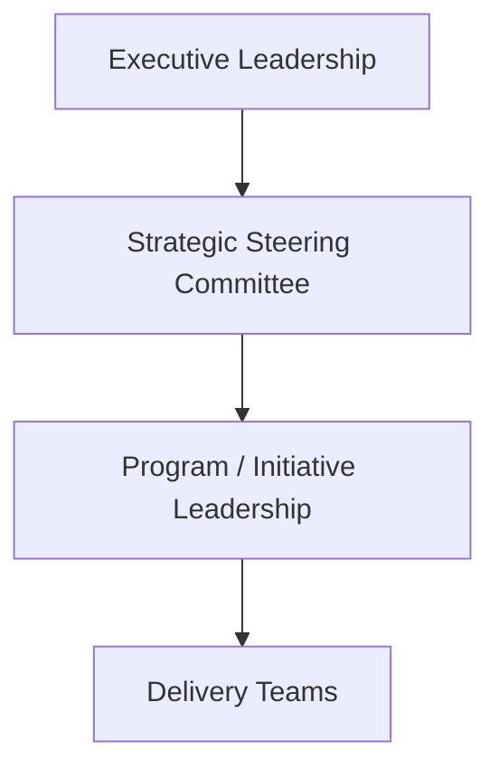
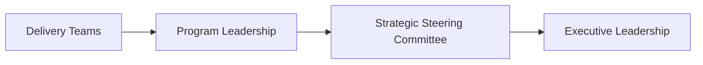

# Governance Structure

This guidance describes the leadership structure used to coordinate priorities, decisions, and oversight across multiple initiatives within an organization.

Enterprise governance provides the mechanism through which leadership aligns strategy, evaluates initiatives, resolves conflicts, and maintains visibility into organizational execution.

While individual programs operate their own delivery governance, enterprise governance ensures that those programs remain aligned with broader organizational priorities.

---

## Purpose of Governance Structure

A governance structure defines how leadership coordinates decision-making across the organization.

Without a defined structure, organizations often experience:

- conflicting priorities across departments  
- unclear decision authority  
- unresolved cross-team dependencies  
- delayed responses to major risks  
- fragmented visibility into organizational execution  

Enterprise governance provides a consistent framework for managing these challenges.

---

## Typical Governance Roles

While organizations vary in structure, enterprise governance typically includes several leadership layers responsible for coordination and oversight.

### Executive Leadership

Senior leadership responsible for defining strategic priorities and approving major investments or organizational initiatives.

Examples may include:

- CEO  
- COO  
- CTO  
- CIO  
- Business Unit Presidents  

Executive leadership focuses on strategic direction and major organizational decisions.

---

### Strategic Steering Committee

A leadership group responsible for overseeing major initiatives and ensuring alignment with organizational priorities.

Typical responsibilities include:

- reviewing progress of major initiatives  
- resolving cross-department conflicts  
- approving major scope or investment changes  
- prioritizing initiatives across the organization  

This group acts as the primary coordination mechanism between strategy and execution.

---

### Initiative or Program Leadership

Leaders responsible for coordinating the execution of specific initiatives or transformation programs.

Depending on the organization, this role may be filled by:

- Program Managers  
- Transformation Leads  
- Technical Program Managers  
- Portfolio Managers  

These leaders coordinate delivery activities and provide reporting to governance structures.

---

### Delivery Teams

Engineering, product, operations, and business teams responsible for executing the work associated with specific initiatives.

These teams operate within program structures while remaining accountable to the broader governance framework.

---

## Governance Structure Model

This model illustrates how enterprise leadership oversight connects strategic direction with execution across multiple initiatives.

---

## Decision Flow

Governance structures help organizations manage how decisions move across leadership levels.

Operational decisions are typically handled by program leadership, while strategic or cross-organizational decisions are elevated to executive governance structures.

This structure helps ensure that decisions are resolved at the appropriate level without unnecessary escalation.

---

## Relationship to Program Governance

Enterprise governance operates above individual program delivery structures.

Program governance focuses on coordinating execution within a specific initiative, including delivery planning, risk management, and operational reporting.

Enterprise governance focuses on:

- strategic prioritization  
- cross-program coordination  
- leadership oversight  
- major decision authority  

Program-level governance structures are described in:

`program-execution-os`

---

## How Governance Structures Are Used

Organizations apply governance structures to support several key activities:

- prioritizing strategic initiatives  
- reviewing program progress and risks  
- resolving conflicts between departments or programs  
- approving major scope or investment changes  
- maintaining executive visibility into organizational execution  

The examples and templates in this repository illustrate practical ways to implement these governance mechanisms.

---
---

Part of the ***Transformation Operating Framework***

Transformation Operating Framework
https://github.com/somerwalker/transformation-operating-framework

Copyright © 2026 Somer Walker

This material is provided for educational and professional reference.  
Commercial use or derivative consulting frameworks requires permission from the author.
