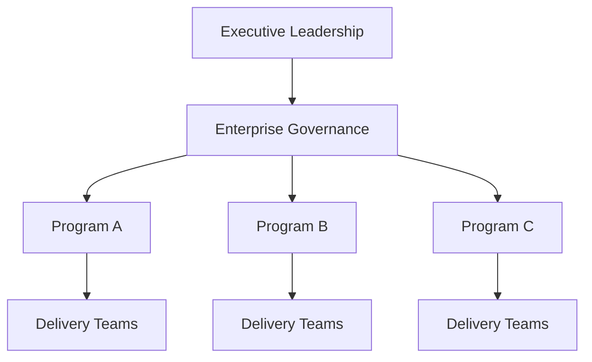

# Portfolio Oversight

This guidance describes how enterprise governance provides visibility and coordination across multiple initiatives within an organization.

While individual programs manage execution within their own delivery structures, enterprise leadership must maintain oversight across the broader portfolio of initiatives. Portfolio oversight ensures that organizational priorities, resources, and strategic objectives remain aligned across programs.

Effective portfolio oversight helps leadership understand the overall health of major initiatives and make informed decisions about prioritization, investment, and organizational focus.

---

## Why Portfolio Oversight Matters

Organizations often run multiple initiatives simultaneously across departments, business units, and technology platforms.

Without portfolio-level oversight, organizations may experience:

- competing initiatives with overlapping objectives  
- conflicting resource demands across programs  
- limited visibility into overall execution progress  
- delayed recognition of strategic risks  
- difficulty prioritizing initiatives during changing conditions  

Portfolio oversight helps leadership maintain a coordinated view of initiatives and make decisions that optimize outcomes for the organization as a whole.

---

## Portfolio Oversight Responsibilities

Enterprise governance structures typically perform several key portfolio oversight functions.

### Initiative Visibility

Leadership maintains visibility into major initiatives across the organization.

Typical visibility includes:

- initiative objectives  
- progress against milestones  
- major risks and dependencies  
- expected business outcomes  

This visibility helps leadership understand the overall health of the portfolio.

---

### Strategic Alignment

Portfolio oversight ensures that active initiatives remain aligned with organizational strategy.

Leadership periodically reviews initiatives to confirm that they continue to support business priorities and strategic direction.

When priorities shift, governance structures may adjust initiative scope, sequencing, or resource allocation.

---

### Resource Prioritization

Organizations often operate with limited resources across engineering, operations, and business teams.

Portfolio oversight allows leadership to evaluate competing demands and allocate resources where they will create the greatest impact.

This may involve:

- adjusting initiative priorities  
- reallocating teams or budgets  
- sequencing initiatives across time

---

### Cross-Program Coordination

Large organizations frequently operate initiatives that interact with each other.

Portfolio oversight helps identify and manage:

- dependencies between programs  
- shared platforms or infrastructure  
- organizational change impacts  
- overlapping delivery timelines  

Coordinating these interactions reduces delivery risk and improves overall execution effectiveness.

---

## Portfolio Oversight Model

This model illustrates how enterprise governance maintains oversight across multiple initiatives while allowing each program to manage its own delivery structure.

---

## Portfolio Review Practices

Organizations often maintain portfolio oversight through recurring leadership review mechanisms.

Common practices include:

- portfolio review meetings  
- strategic initiative reviews  
- executive dashboards summarizing initiative health  
- periodic prioritization discussions  

These practices help leadership maintain visibility and adjust priorities as organizational conditions evolve.

---

## Relationship to Program Execution

Portfolio oversight operates above the delivery structures used within individual programs.

Program-level governance focuses on:

- coordinating execution across teams  
- managing risks and dependencies  
- maintaining delivery visibility  

Enterprise portfolio oversight focuses on:

- prioritizing initiatives across the organization  
- coordinating resources between programs  
- maintaining strategic alignment  

Program-level governance structures are described in:

`program-execution-os`

---
---

Part of the ***Transformation Operating Framework***

Transformation Operating Framework  
https://github.com/somerwalker/transformation-operating-framework

Copyright © 2026 Somer Walker

This material is provided for educational and professional reference.  
Commercial use or derivative consulting frameworks requires permission from the author.
