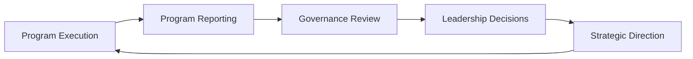

# Governance Cadence

This guidance describes the recurring leadership review rhythms that support enterprise governance.

Governance structures define who is responsible for oversight and decision-making. Governance cadence defines **how often leadership reviews initiatives, evaluates risks, and makes strategic decisions**.

A consistent cadence helps organizations maintain alignment across initiatives while ensuring that leadership attention is directed toward the issues that require it most.

---

## Why Governance Cadence Matters

Enterprise initiatives evolve over time. Priorities shift, risks emerge, and execution progress varies across programs.

Without a consistent governance cadence, organizations often experience:

- delayed recognition of strategic risks  
- inconsistent leadership visibility across initiatives  
- reactive decision-making  
- misalignment between leadership priorities and program execution  
- slow response to changing organizational conditions  

Governance cadence provides a structured rhythm that helps leadership maintain visibility while enabling programs to operate with autonomy.

---

## Typical Governance Reviews

Enterprise governance often includes several recurring review mechanisms.

### Executive Portfolio Review

Executive leadership periodically reviews the portfolio of major initiatives across the organization.

These reviews typically focus on:

- initiative progress and outcomes  
- strategic alignment  
- major risks or blockers  
- prioritization of initiatives and resources  

Executive portfolio reviews help leadership maintain alignment between strategy and active programs.

---

### Strategic Steering Committee

A governance committee may meet regularly to oversee the progress of major initiatives and address issues that require leadership coordination.

Typical responsibilities include:

- reviewing program progress and risks  
- resolving cross-department conflicts  
- approving major initiative adjustments  
- coordinating resource allocation across programs  

These meetings serve as a bridge between executive leadership and program execution.

---

### Initiative or Program Updates

Program leaders provide periodic updates to governance structures summarizing the health and progress of major initiatives.

These updates typically highlight:

- major milestones achieved  
- emerging risks or dependencies  
- decisions requiring leadership input  
- expected impact on business outcomes  

Program updates provide the operational visibility needed for effective governance decisions.

---

## Governance Cadence Model

This cycle illustrates how governance cadence connects execution progress with leadership oversight and strategic direction.

Programs generate delivery signals. Governance reviews interpret those signals and enable leadership decisions that influence future execution.

---

## Preparing for Governance Reviews

Effective governance meetings depend on preparation and coordination before leadership convenes.

Program leaders often prepare:

- concise program summaries  
- updates on major risks or dependencies  
- decision requests requiring leadership input  
- supporting materials for complex issues  

Preparation helps ensure that governance meetings focus on **decisions and alignment**, rather than information gathering.

---

## Relationship to Program Cadence

Governance cadence operates at a different level than program delivery cadence.

Program delivery cadence focuses on coordinating execution across teams, including:

- delivery reviews  
- cross-team coordination meetings  
- milestone checkpoints  

Enterprise governance cadence focuses on:

- strategic oversight of initiatives  
- leadership decision-making  
- cross-program prioritization  

Program delivery cadence structures are described in:

`program-execution-os`

---
---

Part of the ***Transformation Operating Framework***

Transformation Operating Framework  
https://github.com/somerwalker/transformation-operating-framework

Copyright © 2026 Somer Walker

This material is provided for educational and professional reference.  
Commercial use or derivative consulting frameworks requires permission from the author.
