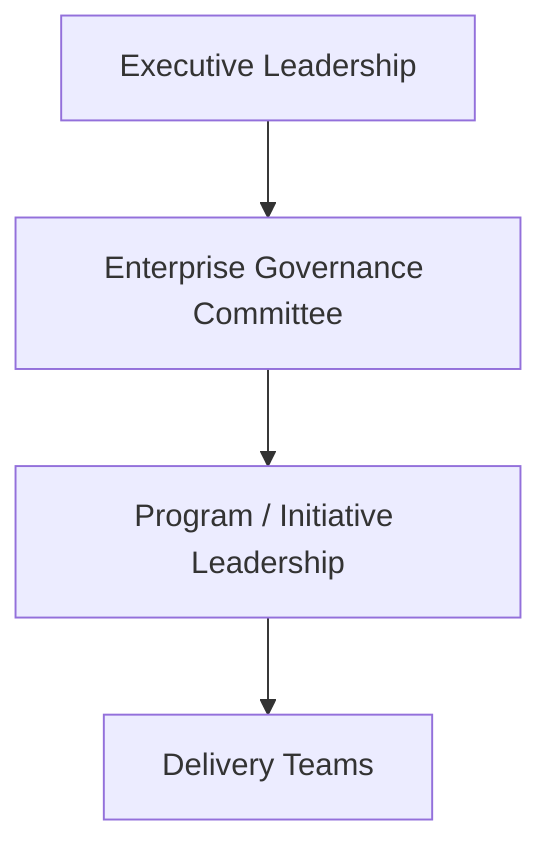
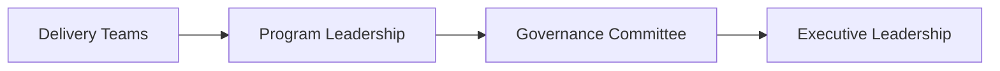

# Example Governance Model

This example illustrates how an organization might structure enterprise governance to coordinate multiple initiatives and maintain leadership oversight across programs.

Governance models vary by organization size, leadership structure, and strategic priorities. The example below demonstrates a common approach used in organizations managing several large initiatives simultaneously.

---

## Governance Structure Overview

### Executive Leadership

Executive leadership defines strategic priorities and approves major investments.

Typical responsibilities include:

- approving strategic initiatives  
- resolving major cross-business conflicts  
- allocating enterprise resources  
- evaluating overall portfolio performance  

---

### Enterprise Governance Committee

A cross-functional leadership group responsible for overseeing major initiatives and ensuring alignment with strategic priorities.

Typical participants may include:

- COO or Chief Transformation Officer  
- CIO / CTO  
- Business unit leaders  
- Finance leadership  
- Program or transformation leadership  

Responsibilities often include:

- reviewing initiative progress and risks  
- resolving cross-department conflicts  
- approving major scope or investment changes  
- prioritizing initiatives within the enterprise portfolio  

---

### Program or Initiative Leadership

Program leaders coordinate execution across teams and provide regular updates to governance structures.

Responsibilities often include:

- coordinating delivery across multiple teams  
- tracking milestones and program health  
- managing risks and dependencies  
- preparing leadership updates for governance reviews  

---

### Delivery Teams

Engineering, product, operations, and business teams responsible for executing the work associated with initiatives.

Delivery teams operate within program governance structures while remaining accountable to enterprise governance oversight.

---

## Decision Flow Example

Enterprise governance structures help ensure that decisions occur at the appropriate level.

Most operational decisions occur at the program level, while strategic or cross-organizational decisions are elevated through governance committees and executive leadership.

---

## Escalation Example

When issues cannot be resolved within a program, they may be escalated through the governance structure.

Examples of escalated issues may include:

- resource conflicts between departments  
- prioritization of competing initiatives  
- major delivery risks affecting business outcomes  
- significant scope or investment changes  

Escalation ensures that leadership attention is directed toward issues that require organizational coordination or authority.

---

## Governance Cadence Example

Enterprise governance often operates through recurring leadership reviews.

Example cadence:

| Meeting | Participants | Purpose | Frequency |
|-------|-------|-------|-------|
| Executive Portfolio Review | Executive leadership | Review overall initiative portfolio and strategic alignment | Quarterly |
| Governance Committee | Cross-functional leadership | Evaluate initiative progress and resolve cross-department issues | Monthly |
| Program Leadership Updates | Program leaders and governance representatives | Provide initiative updates and raise risks or decisions | Monthly |

This cadence helps leadership maintain visibility while allowing programs to operate with execution autonomy.

---

## Relationship to Program Execution

Enterprise governance oversees multiple initiatives across the organization, while individual programs manage execution within their own delivery structures.

Program-level coordination structures are described in:

`program-execution-os`

These structures include:

- program governance models  
- risk management processes  
- delivery cadence frameworks  

Enterprise governance ensures that those programs remain aligned with organizational priorities and leadership direction.

---
---

Part of the ***Transformation Operating Framework***

Transformation Operating Framework  
https://github.com/somerwalker/transformation-operating-framework

Copyright © 2026 Somer Walker

This material is provided for educational and professional reference.  
Commercial use or derivative consulting frameworks requires permission from the author.
