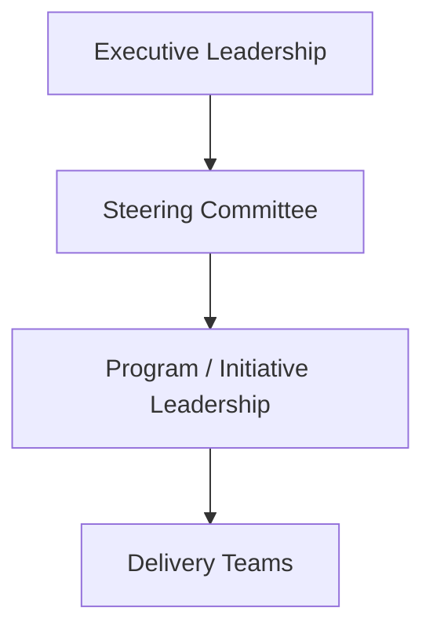

# Example Steering Committee Structure

This example illustrates how an organization might structure a steering committee to oversee major initiatives and coordinate leadership decisions.

Steering committees typically operate as part of the enterprise governance structure, providing a forum for cross-functional leadership to review initiative progress, address risks, and resolve decisions that affect multiple departments.

---

## Purpose of the Steering Committee

The steering committee provides leadership oversight for strategic initiatives and helps ensure alignment between organizational priorities and active programs.

Typical objectives include:

- maintaining visibility into initiative progress  
- resolving cross-department conflicts  
- approving major scope or investment changes  
- prioritizing initiatives across the organization  
- escalating issues requiring executive leadership involvement  

The committee serves as a coordination point between program leadership and executive decision-makers.

---

## Example Steering Committee Structure

The steering committee operates between executive leadership and program leadership, helping translate strategic priorities into coordinated program oversight.

---

## Typical Steering Committee Participants

Steering committees usually include senior leaders representing the major functions involved in the initiative portfolio.

Example participants may include:

| Role | Example Responsibility |
|-----|-----|
| Executive Sponsor | Provides strategic direction and final decision authority |
| Program Sponsor | Represents the business unit responsible for initiative outcomes |
| CIO / CTO | Oversees technology delivery and technical risks |
| Business Unit Leaders | Represent operational priorities and business impact |
| Finance Leadership | Evaluates investment decisions and budget implications |
| Program or Transformation Lead | Presents initiative updates and coordinates program execution |

Participation may vary depending on the organization's structure and the scope of initiatives being governed.

---

## Responsibilities of the Steering Committee

Steering committees typically focus on issues that require cross-organizational coordination or leadership authority.

Common responsibilities include:

- reviewing initiative progress and key milestones  
- evaluating major risks or dependencies  
- resolving cross-team or cross-department conflicts  
- approving scope adjustments or strategic changes  
- prioritizing initiatives across the organizational portfolio  

Operational delivery issues are typically resolved within program governance structures unless escalation is required.

---

## Steering Committee Decision Flow

Issues or decisions that cannot be resolved within program leadership may be escalated to the steering committee.

This escalation path helps ensure that decisions are addressed at the appropriate leadership level while maintaining momentum in program execution.

---

## Example Steering Committee Cadence

Steering committees typically meet on a regular cadence to review initiative progress and address leadership decisions.

Example cadence:

| Meeting | Participants | Purpose | Frequency |
|-------|-------|-------|-------|
| Steering Committee Review | Cross-functional leadership | Review initiative progress, risks, and decisions | Monthly |
| Executive Portfolio Review | Executive leadership | Evaluate portfolio alignment and major strategic decisions | Quarterly |
| Program Leadership Update | Program leadership and governance representatives | Provide updates and escalate issues | Monthly |

Regular governance cadence helps ensure leadership visibility while allowing programs to operate effectively between reviews.

---

## Relationship to Program Governance

Steering committees operate within the broader enterprise governance model.

Program-level governance focuses on coordinating execution across teams, while steering committees address cross-organizational issues and leadership decisions.

Program-level governance structures are described in:

`program-execution-os`

---
---

Part of the ***Transformation Operating Framework***

Transformation Operating Framework  
https://github.com/somerwalker/transformation-operating-framework

Copyright © 2026 Somer Walker

This material is provided for educational and professional reference.  
Commercial use or derivative consulting frameworks requires permission from the author.
