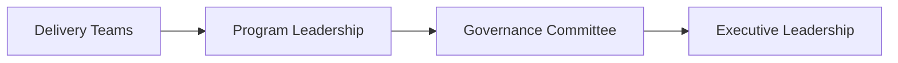

# Governance Model Template

Use this template to define the governance structure used to oversee major initiatives within an organization.

A governance model clarifies leadership roles, decision authority, escalation paths, and review cadence. Documenting these elements helps organizations maintain alignment across initiatives while ensuring leadership has appropriate visibility and oversight.

This template captures the key elements of an enterprise governance structure.

---

## Governance Overview

Provide a short description of the governance model and the types of initiatives it oversees.

Example topics may include:

- the purpose of the governance structure  
- the types of initiatives or programs covered  
- how governance supports organizational strategy  

---

## Governance Roles

Define the leadership roles involved in governance and their responsibilities.

| Role | Responsibility | Typical Participants |
|-----|-----|-----|
| Executive Leadership | Defines strategic priorities and approves major initiatives | CEO, COO, CIO, CTO, Business Unit Leaders |
| Governance Committee | Oversees initiative progress and resolves cross-department issues | Senior leadership across functions |
| Program / Initiative Leadership | Coordinates delivery across teams and reports initiative progress | Program Managers, Transformation Leads |
| Delivery Teams | Execute the work associated with initiatives | Engineering, Product, Operations |

Describe any additional governance roles specific to the organization.

---

## Decision Authority

Describe how decisions are distributed across governance levels.

Organizations typically assign decision authority based on the scope and impact of the decision.

Examples:

- operational delivery decisions handled by program leadership  
- cross-department decisions handled by governance committees  
- strategic decisions approved by executive leadership  

Detailed decision authority can be documented using:

`templates/decision-authority-template.md`

---

## Escalation Path

Define how issues are escalated when they cannot be resolved within the current level of responsibility.

Example escalation path:

Describe when issues should be escalated and how decisions are communicated back to affected teams.

---

## Portfolio Oversight

Explain how leadership maintains visibility across multiple initiatives.

Topics may include:

- initiative reporting structures  
- leadership dashboards or reporting tools  
- cross-program coordination mechanisms  
- prioritization processes for competing initiatives  

Portfolio oversight helps leadership maintain alignment across the organization's initiative landscape.

---

## Governance Cadence

Define the recurring meetings or leadership reviews used to support governance.

Example cadence:

| Meeting | Participants | Purpose | Frequency |
|-------|-------|-------|-------|
| Executive Portfolio Review | Executive leadership | Review strategic initiatives and priorities | Quarterly |
| Governance Committee | Cross-functional leadership | Review initiative progress and risks | Monthly |
| Program Leadership Updates | Program leaders | Provide initiative updates and escalate issues | Monthly |

Governance cadence should balance leadership visibility with the need for teams to maintain execution focus.

---

## Relationship to Program Governance

Enterprise governance oversees multiple initiatives across the organization.

Individual programs typically operate their own execution governance structures, which coordinate delivery across teams.

Program governance structures are described in:

`program-execution-os`

---
---

Part of the ***Transformation Operating Framework***

Transformation Operating Framework  
https://github.com/somerwalker/transformation-operating-framework

Copyright © 2026 Somer Walker

This material is provided for educational and professional reference.  
Commercial use or derivative consulting frameworks requires permission from the author.
